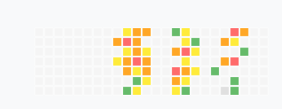
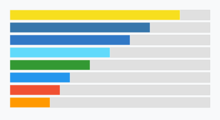

起業準備中です。

## 📊 活動パターン

月曜日始まりの週間活動ヒートマップです。

### 活動レベルの説明
- 🔴 **レベル5**: 高活動（最も活発な時間帯）
- 🟠 **レベル4**: 中高活動
- 🟡 **レベル3**: 中活動
- 🟢 **レベル2**: 低活動
- ⚪ **レベル1**: 非活動
- ⚫ **レベル0**: データなし

## 🛠️ 技術スタック

主に使用している技術の習熟度を表示しています。

### データの更新方法

#### 手動更新
1. `activity-data.json` または `tech-stack-data.json` ファイルを編集
2. `node generate-all.js` を実行してSVGを再生成
3. 変更をコミット・プッシュ

#### 自動更新（GitHub API連携）
GitHub Actionsが毎日午前6時（JST）に実行され、実際のGitHub活動データから自動でビジュアライゼーションを生成します。

### セットアップ方法

#### 1. GitHub Personal Access Token の作成
1. GitHub → Settings → Developer settings → Personal access tokens → Tokens (classic)
2. "Generate new token" をクリック
3. 以下のスコープを選択：
   - `repo` (リポジトリアクセス)
   - `read:user` (ユーザー情報読み取り)
4. トークンをコピーして保存

#### 2. GitHub リポジトリのシークレット設定
1. リポジトリの Settings → Secrets and variables → Actions
2. "New repository secret" をクリック
3. Name: `GITHUB_TOKEN`
4. Secret: 上記で作成したPersonal Access Token
5. "Add secret" をクリック

#### 3. GitHub Actions の有効化
1. リポジトリの Actions タブに移動
2. "I understand my workflows, go ahead and enable them" をクリック
3. 初回実行は手動で "Run workflow" をクリック

### 動作確認
- GitHub Actions の "Update Visualizations" ワークフローが正常に実行されることを確認
- 生成されたSVGファイルがコミットされることを確認
- READMEに表示されるビジュアライゼーションが更新されることを確認
